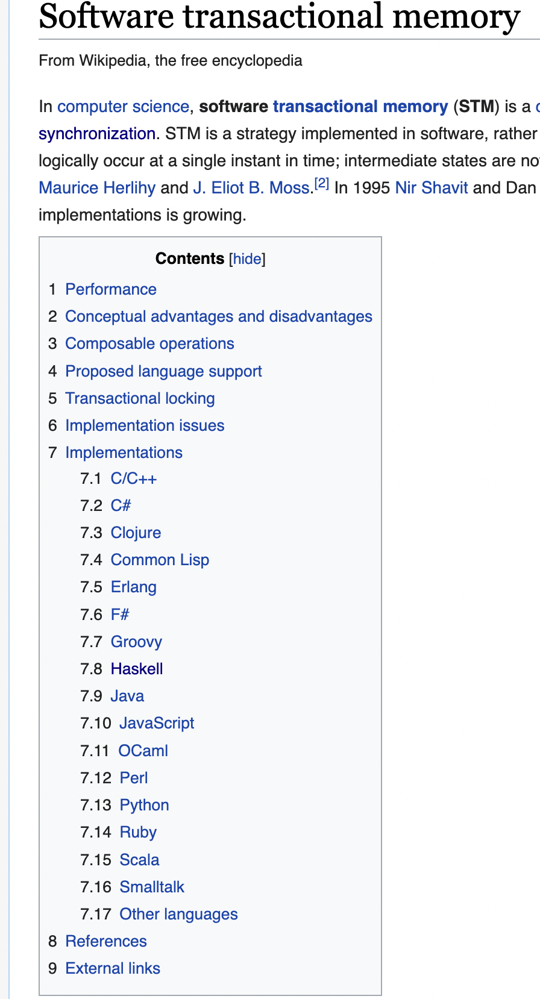
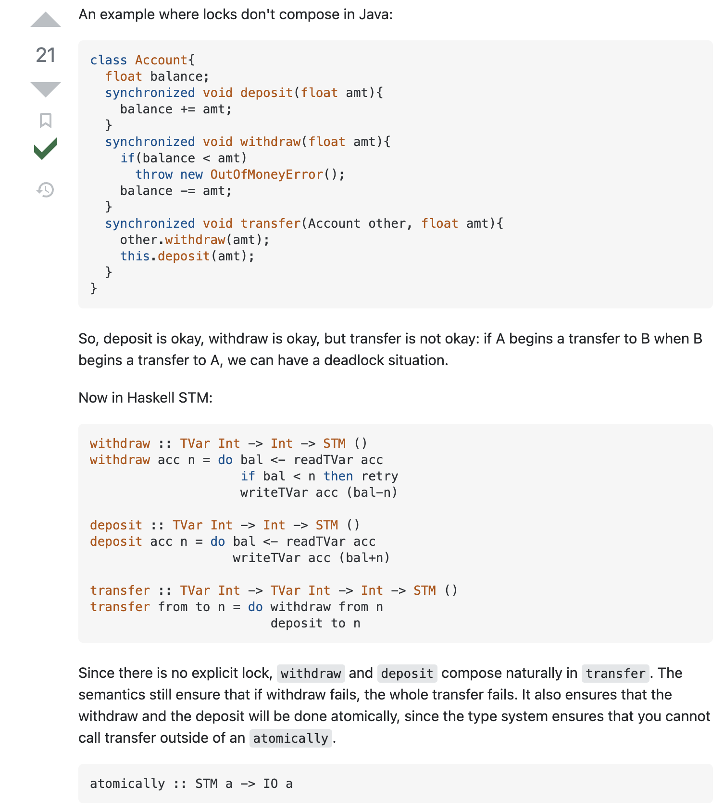

# Software Transactional Memory (STM)

In this post, we'll walk through a brief introduction to concurrency and one of Haskell's best tools for dealing with it: software transactional memory (STM). We'll then use STM to build a simple but powerful asynchronous job queue.
## What is a Job Queue

I'm going to start off with a problem definition because I think it helps clarify when and why you might reach for a tool.

Sometimes when you're building a system, you want to defer computation to some other point in time. Let's say that we don't really care _when_ it happens, as long as it isn't now. We might have a user waiting on the other side of a request, and we're worried that the computation will be time intensive.  
Maybe we know we're going to have a lot of expensive computations to make all at once, and we want to spread them out to smooth the load on our systems.  
Maybe we only want to compute something once a day, and we want to wait and stack up all of our needs to send at a single time.  
Whatever the case, we want to defer that action until later. We'll come back to this idea in a few minutes, but first let's side step into concurrency.


## Comparison to other multi-threading primitives like semaphore, mutex, and locks

Take this section with a grain of salt: at this point in my career I've written a lot more STM code than I have parallel processing code in other languages.
I also read this again to remind myself of the differences:  https://stackoverflow.com/questions/2332765/what-is-the-difference-between-lock-mutex-and-semaphore

* Locks are a way to ensure only a single thread can access a chunk of memory
* A mutex is a system-wide lock, i.e. one shared by multiple processes who all want to access the same memory
* A semaphore is a constrained mutex that avoids too many processes working concurrently in a shared memory space (e.g. I only want _2_ threads working on something at once out of a pool of 50)

I think it's important to call out these structures for a couple of reasons.  
First, as a point of differentiation. STM isn't a Haskell specific system - you can find implementations in a bunch of other languages according to wikipedia.



Second, knowing what other strategies exist can make it easier to know what tool to reach for, but I also think a breadth of knowledge in programming can help people know when to research more and at least have terms to lookup when they are working on a problem. For instance, knowing that STM is great and understanding when to apply a semaphore might lead you to discovering the [`TSem` library](https://hackage.haskell.org/package/stm-2.5.1.0/docs/Control-Concurrent-STM-TSem.html).

Third, you can still screw up STM code. It's not some panacea for concurrent programming. Though it makes things easier, it's still tricky code! Traditional tools for dealing with locks can be useful to orchestrate threads and debug them when something goes wrong.

## What STM is at the basic level

Put as simply as I can STM provides a way to have data which threads can transactionally access.

`Transactionally` there is a pretty important term, in the paper [Software Transactional Memory by Shavit and Touitou](https://dl.acm.org/doi/pdf/10.1145/224964.224987) they define it as:

> A transaction is a finite sequence of local and shared memory machine instructions:
>   * Read_transactional - reads the value of a shared location into a local register.
>   * Write_transactional – stores the contents of a local register into a shared location.


> Any transaction may either fail, or complete successfully, in which case its changes are visible atomically to other processes.

`atomically` is an important word here, and you'll see it come up in the library and our example later as well. 

Funnily enough, the best definition of multi-threaded atomic actions I've read is from the database book _Designing Data Intensive Applications_: 
> if one thread executes an atomic operation, that means there is no way that another thread could see the half-finished result of the operation. The system can only be in the state it was before the operation or after the operation, not something in between.

If you're starting to think in Haskell types, that means we define a function `atomically` which moves us from the specific context of STM actions in to IO in a single, uninterruptable step: `atomically :: STM a -> IO a`.

## Why STM is so great

Composability is the winning feature of STM. Because both the programmer and the compiler can reason about individual blocks of code, we can more quickly write and more importantly understand concurrent programs.

Composability is this fancy word that gets thrown around a lot, but I think it's not always obvious what people mean when they say it. In terms of STM programs, composibility is the ability to take two random pieces of STM code and combine them into a new single function without the risk of deadlocks:
```haskell
functionA :: STM a
functionB :: STM a

functionC :: STM a
functionC = do
  functionA
  functionB
```

I found this good example on [stackoverflow](https://stackoverflow.com/a/5518825/3806046) which illustrates further:



Reading concurrent programs is one of the hardest skills. The real benefit is that any _other_ programmer can come through later and understand it faster than any concurrent code written in the other multi-threading styles.

With all of that said, let's move into the example I promised.

---
## Bullmoose Gardens 
Let's say that I'm running a garden center with a plant delivery business called **Bullmoose Garden Center**.


Periodically, people will call me to get some plants delivered. I write down their order, and promise to deliver later that day. Once per day, I grab my list of orders, load up the truck, and go bring everyone their plants.

In haskell, this could be expressed with the following CLI program.  
```haskell
-- Single threaded processing.
-- Orders come in one at a time, and if I'm not at my desk to take the order it isn't recorded. After making a delivery, I have to restart my process to keep working.
bullmooseGardenCenter1 :: IO ()
bullmooseGardenCenter1 = go []
  where
    go :: [String] -> IO ()
    go otherOrders = do
      order <- getLine
      if order == "deliver"
        then
          putStrLn $ "Deliver: " <> show otherOrders
        else
          go (order:otherOrders)

-- ghci> bullmooseGardenCenter1
-- dirt
-- flowers
-- mums
-- seeds
-- deliver
-- Deliver: ["seeds","mums","flowers","dirt"]
```
---


As it turns out, I love growing things and have the best selection of annual flowers around, so I get a _lot_ of business. All of the sudden, I find myself having to hire a dedicated delivery driver.
When it's just me writing down the orders and then making the deliveries, I don't really have to worry about communication. But now, I need to make sure that when I write down orders, I know whether or not my delivery driver is already out on the road. In other words, I need to know if this order goes onto a current list for deliveries or a _new_ list for deliveries.

We can also write some code to reflect this challenge, and this will be our first use of STM. 
```haskell
newOrderList :: IO (TMVar [String])
newOrderList = newEmptyTMVarIO

-- Now, let's add some complexity. One person takes orders, and on goes and delivers them.
bullmooseGardenCenter2 :: IO ()
bullmooseGardenCenter2 = do
  -- we need some communication channel we can share between people working on the problem.
  orderList <- newOrderList
  atomically $ putTMVar orderList []
  void $ forkIO $ forever $ deliver orderList
  forever $
    takeOrders orderList

  where
    deliver :: TMVar [String] -> IO ()
    deliver orderList = do
      threadDelay 10_000_000 -- take a nap before every delivery
      orders <- atomically $ do
        orders <- takeTMVar orderList
        putTMVar orderList []
        pure orders
      putStrLn $ "Deliver: " <> show orders

    takeOrders :: TMVar [String] -> IO ()
    takeOrders orderList = do
      order <- getLine
      atomically $ do
        list <- takeTMVar orderList
        putTMVar orderList (order:list)


-- ghci> bullmooseGardenCenter2
-- Deliver: []
-- flowers
-- flowers
-- mums
-- mums
-- seeds
-- Deliver: ["seeds","mums","mums","flowers","flowers"]
-- dirt
-- compost
-- mums
-- Deliver: ["mums","compost","dirt"]
```

---
## Aside 1
 I want to slightly modify the code above and show you a common mistake. 

```haskell
bullmooseGardenCenter2ButWithABug :: IO ()
bullmooseGardenCenter2ButWithABug = do
  -- we need some communication channel we can share between people working on the problem.
  orderList <- newOrderList
  void $ forkIO $ forever $ deliver orderList
  forever $
    takeOrders orderList

  where
    deliver :: TMVar [String] -> IO ()
    deliver orderList = do
      threadDelay 10_000_000 -- take a nap after every delivery
      orders <- atomically $ do
        orders <- takeTMVar orderList
        putTMVar orderList []
        pure orders
      putStrLn $ "Deliver: " <> show orders

    takeOrders :: TMVar [String] -> IO ()
    takeOrders orderList = do
      order <- getLine
      atomically $ do
        list <- takeTMVar orderList
        putTMVar orderList (order:list)
```

This code seems pretty close to the previous version, but one important line is missing. That missing line will cause the forked thread to deadlock. When you try to run it, the GHC runtime is able to detect this deadlock, kill the thread, and give you an incredibly helpful error message. 

```haskell
-- ghci> bullmooseGardenCenter2
-- abc
-- def
-- *** Exception: thread blocked indefinitely in an STM transaction
```

Now, I know it doesn't look _that_ impressive. But after working with concurrent systems for awhile, I've gained to an immense appreciation for the fact that not only can GHC detect this deadlock it can specifically tell you that you're running in an STM transaction that gets stuck. 

If you were trying to diff the previous sections, the bug here was not instantiatng the `TMVAR` with an empty list:
```haskell
  atomically $ putTMVar orderList []
```
The double "emptiness" of the TMVar and the list here often lead to me forgetting this step, so I get to see the `thread blocked indefinitely` error a fair amount.

---


Next, let's assume I'm _really_ good at growing things (I'm not actually, but hey we can all dream right?) and my business explodes and all of the sudden I have one hundred delivery drivers and multiple people working the phones to take orders. How am I going to orchestrate all of this?

There are a couple of important things to note in running a business like this:
* I want to make sure that no order is fulfilled more than once.
* I want to be sure that every order that's received is recorded quickly. You can't have two people fighting over the order list trying to record their orders at the same time.
* Similarly, I want to make sure two delivery drivers don't get stuck trying to pick up the same order at the same time.

Okay the analogy might be leaking through to our implementation here.

Most programmers have a tool for this, but they might call it something different depending on where they learned it. With my background, I've always called this kind of work a "Job Queue". The simplest version is really easy to imagine, and equally trivial to build. We just have one system that writes instructions down, then executes them later. The complexity immediately jumps as soon as we have two different processes: one to write and one to read. Then, we have another jump in complexity when we have multiple processes reading and writing at the same time.

Quickly, the right solution to your problem involves utilizing multithreading processing techniques. These often sound scary, but in haskell, it's much easier to deal with.

```haskell
newOrderQueue :: IO (TQueue String)
newOrderQueue = newTQueueIO

newDeliveryLogAccess :: IO (TMVar ())
newDeliveryLogAccess = newEmptyTMVarIO

-- In our penultimate version, we'll have multiple people taking orders as well as multiple delivery drivers. We're going to upgrade from a single list to a queue of orders that each need to be delivered in isolation.
bullmooseGardenEmpire :: IO ()
bullmooseGardenEmpire = do
  orderQueue <- newOrderQueue
  deliveryLog <- newDeliveryLogAccess
  atomically $ putTMVar deliveryLog ()
  forM_ [1 ..10] $ \n -> forkIO $ forever $ deliver n orderQueue deliveryLog
  forM_ [1 :: Int ..5] $ \_ -> forkIO $ forever $ takeOrders orderQueue

  where
    deliver :: Int -> TQueue String -> TMVar () -> IO ()
    deliver n orderQueue deliveryLog = do
      napLength <- randomRIO (8_000_000,10_000_000)
      threadDelay napLength -- take a nap before every delivery
      order <- atomically $ readTQueue orderQueue
      -- Take turns logging about this so that you don't ruin my beautiful console output
      void $ atomically $ takeTMVar deliveryLog
      putStrLn $ "Driver " <> show n <> " delivering: " <> show order
      atomically $ putTMVar deliveryLog ()

    takeOrders :: TQueue String -> IO ()
    takeOrders orderQueue = do
      x :: Int <- randomRIO (0, 7)
      let order = ["seeds","flowers","mums","dirt","compost","tools","fountains","plant starts"] !! x
      atomically $ writeTQueue orderQueue order


-- ghci> bullmooseGardenEmpire
-- ghci> Driver 1 delivering: "flowers"
-- Driver 2 delivering: "dirt"
-- Driver 10 delivering: "seeds"
-- Driver 3 delivering: "seeds"
-- Driver 6 delivering: "compost"
-- Driver 8 delivering: "seeds"
-- Driver 7 delivering: "dirt"
-- Driver 5 delivering: "tools"
-- Driver 4 delivering: "seeds"
-- Driver 9 delivering: "tools"
-- Driver 5 delivering: "mums"
-- Driver 2 delivering: "dirt"
-- Driver 6 delivering: "compost"
-- Driver 8 delivering: "mums"
-- Driver 10 delivering: "mums"
-- Driver 1 delivering: "flowers"
-- Driver 3 delivering: "fountains"
-- Driver 7 delivering: "seeds"
-- Driver 9 delivering: "fountains"
-- Driver 4 delivering: "seeds"

```

--- 
## Aside 2

You may have noticed an extra bit of STM code in that previous section. If you take it out, here's what your stdout output looks like: 

```
Driver 4 delivering: "compost"
DriDDvrreiirvv ee8rr   d29e  lddieevlleiirvvieenrrgii:nn gg"::p  l""amfnultmo sws"et
rasr"t
s"
DDrDririviveverer r 7 4 3 d dedelelilivivevereririningng:g: : " "s"memueumdmsss"""


Driver 1 delivering: "tools"
```

STM is such an easy and powerful tool, I found myself, somewhat ironically, just reaching for it here to clean up my stdout output entirely separate from my motivating example of why STM is great! 

---


Last, let's showcase composability here with an example similar to the one from StackOverflow we looked at earlier. 

```haskell

-- As one last example, let's showcase the composability of STM. Imagine we're in the same scenario as the last, but this time we have two extra employees who works both the phones and the deliveries, depending on where they are needed most.

bullmooseGardenEmpire2 :: IO ()
bullmooseGardenEmpire2 = do
  orderQueue <- newOrderQueue
  deliveryLog <- newDeliveryLogAccess
  atomically $ putTMVar deliveryLog ()
  forM_ [1..10] $ \n -> forkIO $ forever $ deliver n orderQueue deliveryLog
  forM_ [1 :: Int ..5] $ \_ -> forkIO $ forever $ takeOrders orderQueue
  forM_ [1 :: Int ..2] $ \_ -> forkIO $ forever $ deliverOrTakeOrders orderQueue deliveryLog

  where

    deliverSTM :: TQueue String -> STM String
    deliverSTM orderQueue = readTQueue orderQueue


    deliver :: Int -> TQueue String -> TMVar () -> IO ()
    deliver n orderQueue deliveryLog = do
      napLength <- randomRIO (8_000_000,10_000_000)
      threadDelay napLength -- take a nap before every delivery
      order <- atomically $ deliverSTM orderQueue
      -- Take turns logging about this so that you don't ruin my beautiful console output
      void $ atomically $ takeTMVar deliveryLog
      putStrLn $ "Driver " <> show n <> " delivering: " <> show order
      atomically $ putTMVar deliveryLog ()

    takeOrderSTM :: String -> TQueue String -> STM ()
    takeOrderSTM order orderQueue = writeTQueue orderQueue order

    takeOrders :: TQueue String -> IO ()
    takeOrders orderQueue = do
      x :: Int <- randomRIO (0, 7)
      napLength <- randomRIO (8_000_000,10_000_000)
      threadDelay napLength -- take a nap before every order
      let order = ["seeds","flowers","mums","dirt","compost","tools","fountains","plant starts"] !! x
      atomically $ takeOrderSTM order orderQueue

    deliverOrTakeOrdersSTM :: TQueue String -> STM String
    deliverOrTakeOrdersSTM orderQueue = do
      -- If there is something on the queue, go ahead and deliver it.
      -- If not, go answer the phones. For some reason, it's always dahlias?
      deliverSTM orderQueue `orElse` (takeOrderSTM "dahlias" orderQueue *> pure "Took an order for dahlias")

    deliverOrTakeOrders :: TQueue String -> TMVar () -> IO ()
    deliverOrTakeOrders orderQueue deliveryLog = do
      napLength <- randomRIO (8_000_000,10_000_000)
      threadDelay napLength -- take a nap before every order
      workerOutput <- atomically $ deliverOrTakeOrdersSTM orderQueue
      void $ atomically $ takeTMVar deliveryLog
      putStrLn workerOutput
      atomically $ putTMVar deliveryLog ()

-- ghci> bullmooseGardenEmpire2
-- ghci> Driver 10 delivering: "dirt"
-- Took an order for dahlias
-- Driver 4 delivering: "dahlias"
-- Took an order for dahlias
-- Driver 8 delivering: "dahlias"
-- Driver 2 delivering: "mums"
-- Driver 1 delivering: "seeds"
-- Driver 9 delivering: "fountains"
-- Driver 3 delivering: "tools"
-- Driver 5 delivering: "flowers"
-- Took an order for dahlias
-- Driver 7 delivering: "dahlias"
-- Driver 6 delivering: "mums"
-- Driver 10 delivering: "dirt"
-- Driver 8 delivering: "fountains"
-- Took an order for dahlias
-- Driver 4 delivering: "dahlias"
-- Driver 3 delivering: "flowers"


```

(You can get access to a full copy of the code in this post [here](https://gist.github.com/jkeuhlen/03a9005dfc9ce6d051c367f13546a7eb). There _might_ be a GHC extension or two missing - I built it locally with my normal set of extensions enabled.)

(This post is a long-form version of a talk I gave at a Mercury hosted Haskell meetup in Portland on 2022-10-20)


