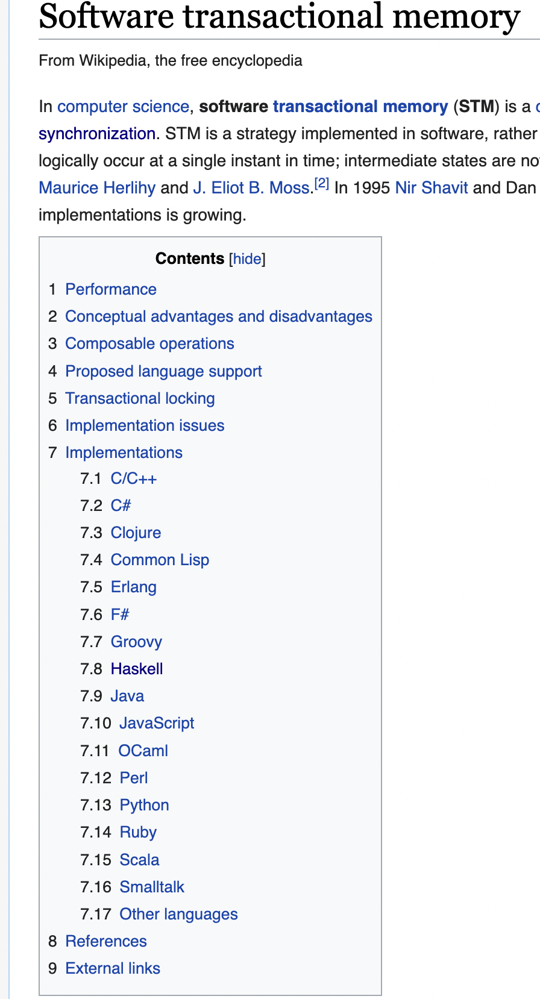

# Software Transactional Memory (STM)

In this post, we'll walk through a brief introduction to concurrency and one of Haskell's best tools for dealing with it: software transactional memory (STM). We'll then use STM to build a simple but powerful asynchronous job queue.

## What is a Job Queue

I'm going to start off with a problem definition because I think it helps clarify when and why you might reach for a tool.

Sometimes when you're building a system, you want to defer computation to some other point in time. Let's say that we don't really care _when_ it happens, as long as it isn't now. We might have a user waiting on the other side of a request, and we're worried that the computation will be time intensive. Maybe we know we're going to have a lot of expensive computations to make all at once, and we want to spread them out to smooth the load on our systems. Maybe we only want to compute something once a day, and we want to wait and stack up all of our needs to send at a single time. Whatever the case, we want to defer that action until later. Lets walk through a real world example.

Let's say that I'm running a landscaping delivery business. Periodically, people will call me to get some plants delivered. I write down their order, and promise to deliver later that day. Once per day, I grab my list of orders, load up the truck, and go bring everyone their plants.

As it turns out, I love growing things and have the best selection of annual flowers around, so I get a _lot_ of business. All of the sudden, I find myself having to hire a dedicated delivery driver.
When it's just me writing down the orders and then making the deliveries, I don't really have to worry about communication. But now, I need to make sure that when I write down orders, I know whether or not my delivery driver is already out on the road. In other words, I need to know if this order goes onto a current list for deliveries or a _new_ list for deliveries.

As soon as we introduced the second worker, the system gets a whole lot more complicated.

But, I'm _really_ good at growing things and my business explodes and all of the sudden I have one hundred delivery drivers and multiple people just manning the phones to take orders. How am I going to orchestrate all of this?

There are a couple of important things to note in running a business like this:
* You want to make sure that no order is fulfilled more than once.
* You want to be sure that every order that's received is recorded quickly.
* You want to make sure two deliviery drivers don't get stuck trying to pick up the same order at the same time.

Okay that last one might be me just breaking through the analogy.

Most programmers have a tool for this, but they might call it something different depending on where they learned it. With my background, I've always called this kind of work a "Job Queue". The simplest version is really easy to imagine, and equally trivial to build. We just have one system that writes instructions down, then executes them later. The complexity immediately jumps as soon as we have two different processes: one to write and one to read. Then, we have another jump in complexity when we have multiple processes reading and writing at the same time.

Quickly, the right solution to your problem involves utilizing multithreading processing techniques. These often sound scary, but in haskell, it's really easy to deal with.

## What STM is at the basic level

A way to have memory regions that have synchronization tools built in software (yes, there is a way to do _hardware_ transactional memory but that's beyond the scope of this post)

From the paper (Software Transactional Memory by Shavit and Touitou)[https://dl.acm.org/doi/pdf/10.1145/224964.224987]:

> A transaction is a finite sequence of local and shared memory machine instructions:
>   Read_transactional - reads the value of a shared location into a local register.
>   Write_transactional – stores the contents of a local register into a shared location.
> The data set of a transaction is the set of shared locations accessed by the Read-transactional and Write-transactional instructions. Any transaction may either fail, or complete successfully, in which case its changes are visible atomically to other processes.

## Comparison to other multi-threading primitives like semaphor, mutex, and locks

Take everything I write here with a grain of salt: at this point in my career I've written a lot more STM code than I have parallel processing code in other languages.
I also read this again to remind myself of the differences:  https://stackoverflow.com/questions/2332765/what-is-the-difference-between-lock-mutex-and-semaphore

* Locks are a way to ensure only a single thread can access a chunk of memory
* A mutex is a system-wide lock, i.e. one shared by multiple processes who all want to access the same memory
* A semaphore is a constrained mutex that avoids too many processes working concurrently in a shared memory space (e.g. I only want _2_ threads working on something at once out of a pool of 50)

## Why STM is so much better than these things

Composibility is the winning feature of STM. Because both the programmer and the compiler can reason about individual blocks of code, we can more quickly write and more importantly read concurrent programs.

Reading concurrent programs is one of the hardest skills. We're going to walkthrough writing a simple example in just a moment and I bet that anyone with experience in haskell could slap together a concurrent program in a couple of hours at most. The real benefit is that any _other_ programmer can come through later and read your code and understand it faster than any concurrent code written in the older locking style.

STM isn't a Haskell specific system - you can find implementations in a bunch of other languages according to wikipedia.

## Building the basics of a multi-process job queue with STM

